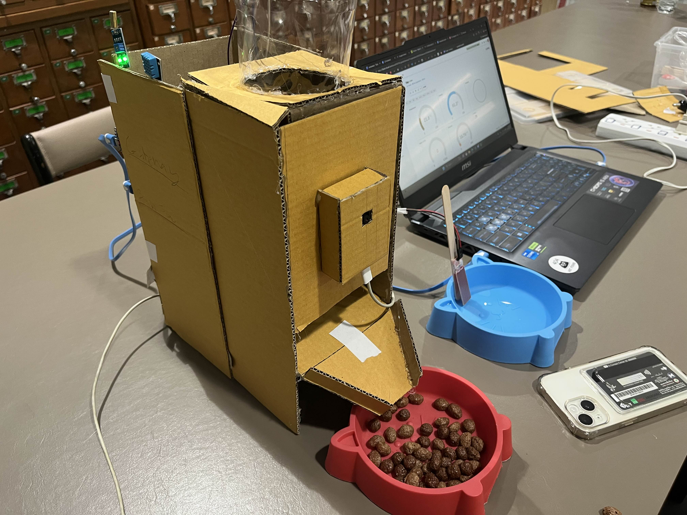

# ESP32 Smart Cat Feeder (Sensor + Gateway + ESP32-CAM)



3 ESP32 boards plus supporting services:
- **Sensor node** sends water level and ultrasonic distance over ESP-NOW.
- **Gateway node** receives data, pushes to Blynk/Google Sheets, and drives the feeder servo.
- **ESP32-CAM** streams video.
- **Proxy backend (Node.js)** fans out the stream, exposes feeding API, and SSE cooldown timer.
- **Python cat detector** watches the stream and triggers feeding automatically.
- **Web dashboard** shows live metrics, controls feeding, and displays the camera.

## High-Level Flow
- Sensor → ESP-NOW → Gateway → Blynk/Google Sheets.
- ESP32-CAM → Proxy `/stream` → Dashboard / Python detector.
- Dashboard / Detector → Proxy `/feed` → Blynk V4 → Servo (via Gateway).
- Proxy `/time` SSE → Dashboard cooldown display.

## Components

### Sensor Node (`pro pro sensor node`)
- Reads water level (ADC GPIO34) and ultrasonic (TRIG 12, ECHO 14).
- Wi-Fi STA + ESP-NOW to Gateway every 1s: `waterLevel (int)` + `distance (float)`.
- Configure `ssid/pass` and `gatewayMAC` in `src/main.cpp`.

### Gateway Node (`propet gateway node`)
- Receives ESP-NOW and sends to Blynk: V1=water, V5=distance, V2=temp, V3=humidity, V6=vibration.
- Sensors: DHT11 on GPIO4, vibration on GPIO18.
- Feeder servo on GPIO13, triggered by Blynk V4; pushes logs to Google Sheets (`GAS_URL`).
- Configure Wi-Fi/Blynk token/channel in `src/main.cpp`.

### ESP32-CAM (`pro pet esp cam`)
- AI Thinker board; pins from `include/board_config.h`.
- JPEG streaming web server (default `http://<cam-ip>:81/stream`).
- Configure Wi-Fi in `src/main.cpp`.

### Proxy Backend (`stream-proxy-server`)
- Pulls camera stream (`STREAM_URL`, default `http://172.20.10.12:81/stream`) and serves `GET /stream`.
- `GET /feed`: toggles Blynk V4 with 2h cooldown.
- `GET /time`: SSE for cooldown/remaining time.
- Uses `BLYNK_TOKEN`; can override via env.

### Python Cat Detector (`python-cam-server/cat_detector.py`)
- Reads stream from proxy (`http://localhost:3000/stream`).
- SSD MobileNet V2 (`frozen_inference_graph.pb`, `ssd_mobilenet_v2_coco_2018_03_29.pbtxt`) detects cats (class 17).
- On detection: call `/feed` and log to Google Sheet.
- Model files must be in the same folder.

### Web Dashboard (`web-dashboard`)
- Polls Blynk every 2s: V1 water%, V3 humidity, V2 temperature, V5 food distance→percent, V6 vibration.
- Feed button calls `SERVER_URL/feed` (respects cooldown) and listens to `SERVER_URL/time` SSE.
- Shows camera via `SERVER_URL/stream`.
- Adjust `SERVER_URL`/Blynk token in `src/App.jsx` if not using defaults.

## Hardware Wiring


### Sensor Node Pinout
| Module / Signal     | ESP32 Pin | Notes                         |
| ------------------- | --------- | ----------------------------- |
| Water level analog  | GPIO34    | ADC input                     |
| Ultrasonic TRIG     | GPIO12    | Trigger output                |
| Ultrasonic ECHO     | GPIO14    | Echo input                    |

### Gateway Node Pinout
| Module / Signal | ESP32 Pin | Notes                                             |
| --------------- | --------- | ------------------------------------------------- |
| DHT11 DATA      | GPIO4     | Temperature / humidity                            |
| Vibration (dig) | GPIO18    | Motion/vibration input                            |
| Servo signal    | GPIO13    | Feeder; power with external 5V, share common GND  |

### ESP32-CAM (AI Thinker) Pin Reference
- From `include/board_config.h`: Y2=5, Y3=18, Y4=19, Y5=21, Y6=36, Y7=39, Y8=34, Y9=35, VSYNC=25, HREF=23, PCLK=22, XCLK=0, SIOD=26, SIOC=27, PWDN=32, LED=4.
- Stable 5V supply recommended; antenna/booster if Wi-Fi is weak.

## Quick Start
1) **Flash boards**
   - Sensor: set `ssid/pass` + `gatewayMAC` → upload `pro pro sensor node`.
   - Gateway: set `ssid/pass`, `BLYNK_AUTH_TOKEN`, `GAS_URL`, `FIXED_CHANNEL` → upload `propet gateway node`.
   - ESP32-CAM: set Wi-Fi in `pro pet esp cam/src/main.cpp` → upload (AI Thinker).

2) **Run Proxy**
   ```bash
   cd stream-proxy-server
   npm install
   STREAM_URL=http://<cam-ip>:81/stream BLYNK_TOKEN=<token> node server.js
   ```

3) **Run Cat Detector (optional AI)**
   ```bash
   cd python-cam-server
   pip install -r requirements.txt
   python cat_detector.py
   ```
   Ensure `.pb` and `.pbtxt` model files are present.

4) **Run Web Dashboard**
   ```bash
   cd web-dashboard
   npm install
   npm run dev
   ```
   Update `SERVER_URL` in `src/App.jsx` if proxy is not `http://localhost:3000`.

5) **Test**
   - Open Dashboard → confirm stream/sensor data → press Feed (cooldown 2h).
   - Verify servo moves and Blynk values update.

## Configuration Checklist
- Wi-Fi SSID/PASS on all three boards.
- `gatewayMAC` on Sensor matches Gateway MAC (STA mode).
- `BLYNK_AUTH_TOKEN`, `GAS_URL`, `FIXED_CHANNEL` (Gateway).
- `STREAM_URL`, `BLYNK_TOKEN` (Proxy) and `SERVER_URL` (Dashboard).
- Google Sheet URLs in both Gateway and Python detector.
